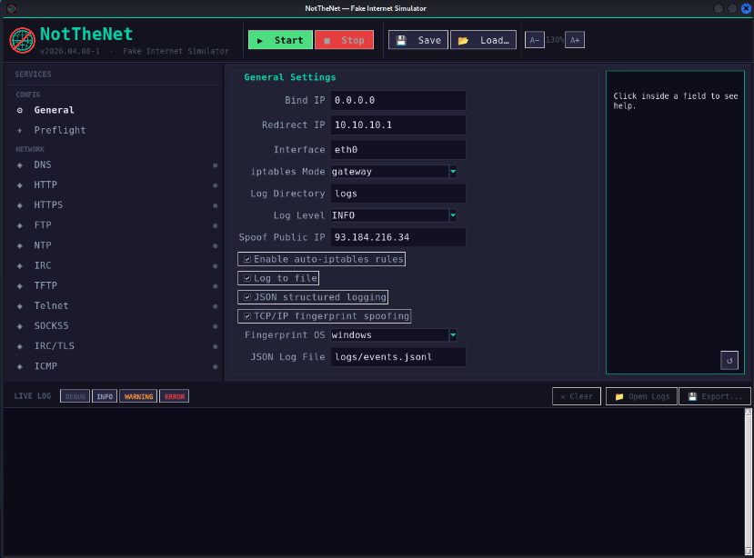

# NotTheNet — Fake Internet Simulator

<p align="center">
  <a href="https://github.com/retr0verride/NotTheNet/actions/workflows/ci.yml"></a>
  <a href="https://github.com/retr0verride/NotTheNet/actions/workflows/codeql.yml"></a>
  <a href="https://securityscorecards.dev/viewer/?uri=github.com/retr0verride/NotTheNet"></a>
  <a href="https://github.com/retr0verride/NotTheNet/releases/latest"></a>
  <a href="LICENSE"></a>
</p>

<p align="center">
  
</p>

> **For malware analysis and sandboxed environments only.**
> Never run on a production network or internet-connected interface.

NotTheNet simulates the internet for malware being detonated in an isolated lab. It replaces INetSim and FakeNet-NG with a single Python application and a live GUI — no race conditions, no socket leaks, no opaque config files.

---

## Quick Start

```bash
git clone https://github.com/retr0verride/NotTheNet
cd NotTheNet
sudo bash notthenet-install.sh
sudo notthenet
```

**Air-gapped / offline install** (Kali has no internet — build the bundle on Windows, copy via USB):

```powershell
.\make-bundle.ps1 -SkipChecks    # -> dist/NotTheNet-bundle.zip + ISO
```
```bash
# On Kali:
sudo bash notthenet-bundle.sh
sudo notthenet
```

---

## What It Does

- **27 fake services** running simultaneously — DNS, DoT, HTTP/S, SMTP/S, POP3/S, IMAP/S, FTP, NTP, TFTP, IRC, Telnet, SOCKS5, VNC, RDP, SMB, MySQL, MSSQL, Redis, LDAP, ICMP, TCP/UDP catch-all
- **Every DNS query resolves** to your Kali IP, with DGA/canary-domain NXDOMAIN detection
- **Dynamic TLS certs** — root CA + per-SNI cert forging; fake SCT extension; DoH + DoT interception
- **Public-IP spoofing** — 20+ IP-check endpoints return a fake residential IP (defeats AgentTesla, FormBook, stealers)
- **TCP/IP fingerprint spoofing** — fakes TTL, window size, MSS to mimic Windows/Linux/macOS
- **Dynamic file responses** — 70+ MIME-correct file stubs (.exe, .dll, .pdf, .zip, ...)
- **Response delay + jitter** — 120 +/- 80 ms artificial latency defeats timing-based sandbox detection
- **Session-labelled JSON logs** — each Start creates logs/events_YYYY-MM-DD_s1.jsonl, _s2.jsonl, ... automatically
- **Privilege drop** — binds ports as root then drops to nobody:nogroup
- **Process masquerade** — title set to [kworker/u2:1-events] to hide from ps
- **Dark GUI** — live colour-coded log, JSON Events viewer with search/filter, zoom controls
- **Preflight checks** — readiness audit + remote victim validation before detonation
- **Lab hardening** — harden-lab.sh stops conflicting services, blocks bridge<->management pivoting

---

## Requirements

- Kali Linux / Debian 12 / Ubuntu 22.04+
- Python 3.10+
- python3-tk (pre-installed on Kali)
- Root (for ports < 1024 and iptables)

---

## Docs

| Guide | |
|---|---|
| [Installation](docs/installation.md) | Install, update, uninstall, offline USB bundle |
| [Configuration](docs/configuration.md) | Every config.json field with examples |
| [Usage](docs/usage.md) | GUI walkthrough, CLI mode, analysis workflow |
| [Services](docs/services.md) | Per-service technical reference |
| [Network & iptables](docs/network.md) | Traffic redirection, loopback vs gateway, TTL mangle |
| [Lab Setup](docs/lab-setup.md) | Proxmox + Kali + FlareVM wiring guide |
| [Safe Detonation](docs/safe-detonation.md) | Proxmox snapshots, KVM cloaking, artifact handling |
| [Security Hardening](docs/security-hardening.md) | Lab isolation, privilege model, OpenSSF practices |
| [Troubleshooting](docs/troubleshooting.md) | Common errors and fixes |
| [Changelog](CHANGELOG.md) | Full release history |

Man page: [man/notthenet.1](man/notthenet.1) — installed automatically by notthenet-install.sh.

---

## Development

```bash
pytest tests/ -v              # 253 tests — pure Python, no root, no network
ruff check .                  # lint
bandit -r . --exclude .venv   # SAST
```

See [CONTRIBUTING.md](CONTRIBUTING.md) and [docs/development.md](docs/development.md).

---

## License

MIT — see [LICENSE](LICENSE).
