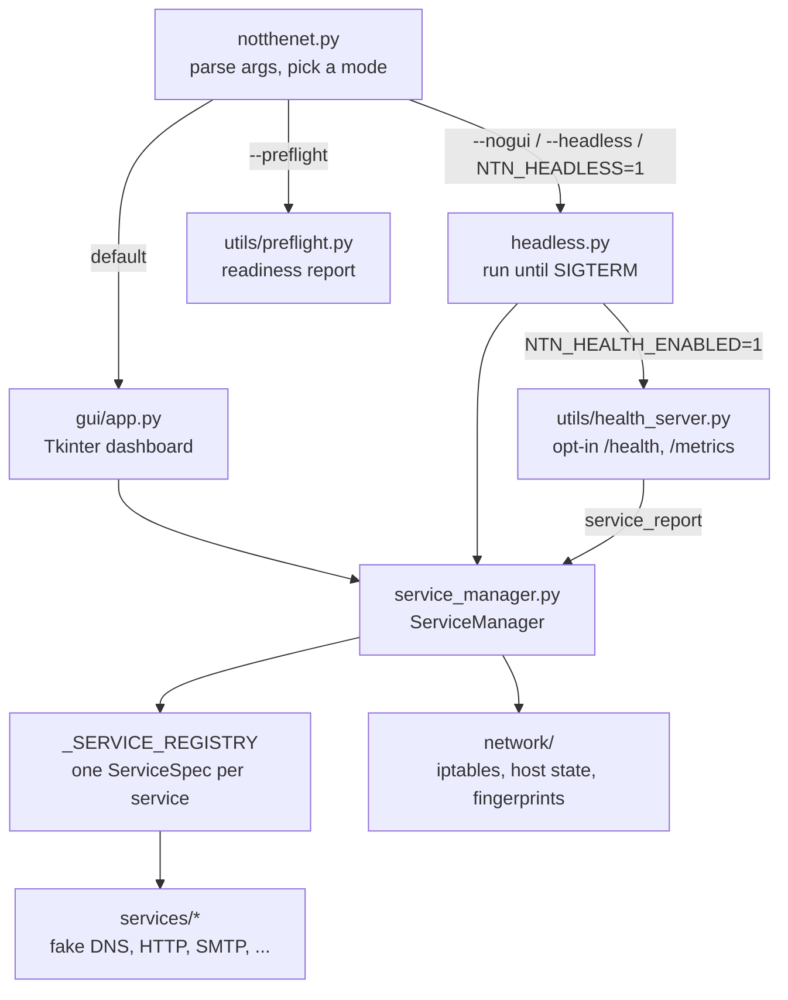

# Architecture

How NotTheNet is put together, where to make common changes, and how a release ships. Read this before your first change.

---

## The big picture

One process. `ServiceManager` starts a set of fake protocol servers, then points the host's iptables at them so every outbound connection from the lab lands on one of those servers.

## Run modes

`notthenet.py` is the only entry point. It makes the project root the working directory (runtime paths like `certs/` and `logs/` are relative to it), configures logging, and dispatches:

| Mode | Selected by | Code | Imports tkinter |
|------|-------------|------|-----------------|
| GUI | default | `gui/app.py:run_gui` | yes |
| Headless | `--nogui`, `--headless`, `NTN_HEADLESS=1` | `headless.py:run` | no |
| Preflight | `--preflight` | `utils/preflight.py` | no |

systemd (`assets/notthenet.service`) runs headless without the health endpoint. Docker runs headless with `NTN_HEALTH_ENABLED=1` so its `HEALTHCHECK` can poll `/health/live`. A test (`tests/test_health_server.py`) fails if the headless path ever imports tkinter or pydantic.

## Startup sequence

`ServiceManager.start()` in `service_manager.py`, in order:

1. Validate `config.json` (`utils/validators.py`). Any error aborts.
2. Restore root if a previous run dropped it, and warn if not root.
3. Host prep, if enabled: stop conflicting system services (`auto_evict_services`), apply lab hardening (`auto_hardening`).
4. Warn on duplicate port assignments.
5. Open the JSONL event log and make sure TLS certs exist.
6. Build and start every service in `_SERVICE_REGISTRY` order.
7. Apply iptables rules for the services that actually started (`auto_iptables`).
8. Apply TCP/IP fingerprint spoofing (`tcp_fingerprint`) and process-title masquerade (`process_masquerade`).
9. Drop root to the configured service account (`drop_privileges`). If the drop is enabled and fails while running as root, stop everything and exit rather than serve traffic as root.

Every flag in parentheses lives under `general` in `config.json` and defaults to on.

`stop()` reverses it: stop services in parallel, remove iptables rules, restore saved host state.

## Code map

| Path | What lives there |
|------|------------------|
| `notthenet.py` | CLI entry point: arguments, mode dispatch, crash log |
| `headless.py` | Headless runner: start, wait for a signal, stop |
| `version.py` | `APP_VERSION`, the single version source |
| `config.py` | `Config`: load, read, write `config.json` |
| `service_manager.py` | `ServiceManager` and `_SERVICE_REGISTRY` |
| `services/base.py` | `ServiceProtocol`, the interface every service implements |
| `services/*_server.py` | One fake protocol per module |
| `services/mail_common.py` | Connection-capped TCP/TLS servers shared by SMTP, POP3, IMAP |
| `services/http_server.py` | HTTP/HTTPS handler and servers |
| `services/http_catalog.py` | Host lists and canned bodies the HTTP handler recognises (pure data) |
| `services/http_routes.py`, `cloud_exfil_routes.py` | Per-host HTTP route handlers |
| `network/iptables_manager.py` | Builds, applies and removes the NAT/filter/mangle rules |
| `network/host_state.py` | Saves and restores iptables tables, `ip_forward`, promisc mode; atexit safety net |
| `network/iface_watcher.py` | Netlink watcher that blocks pivots on newly addressed interfaces |
| `network/tcp_fingerprint.py` | TCP/IP OS fingerprint spoofing |
| `utils/health_server.py` | Opt-in health and metrics HTTP endpoint (spec: `openapi.yaml`) |
| `utils/json_logger.py` | JSONL event log (the analysis record) |
| `utils/logging_utils.py` | Logging setup and log-injection sanitisers |
| `utils/cert_utils.py` | Root CA, server certs, per-domain cert forging |
| `utils/privilege.py` | Root checks and privilege drop/restore |
| `utils/validators.py` | Config and input validation |
| `gui/` | Dashboard: `app.py` window, `views.py` layout, `logic.py` start/stop, `dialogs.py` pages, `service_pages.py` page specs |
| `tests/` | pytest suite; runs without root or network |
| `scripts/checks.py` | The quality gate; CI runs the same script |

## Adding a service

1. **Write the service** in `services/<name>_server.py`. The class takes `(config: dict, bind_ip: str = "0.0.0.0")` and satisfies `ServiceProtocol`: an `enabled` attribute, `start() -> bool` (return `False` when disabled or the bind fails), `stop()`, and a `running` property. Copy the shape of a small existing service such as `services/redis_server.py`.
2. **Add a config section** to `config.json` with at least `enabled` and `port`.
3. **Register it** with a `ServiceSpec` in `_SERVICE_REGISTRY` (`service_manager.py`): name, class, config section, default port (0 for none), protocol (`tcp`, `udp` or `both`), and `tls=True` if it needs the HTTPS cert paths merged into its config. iptables redirects are generated from the registry, so nothing else is needed for traffic to reach it.
4. **Expose it in the GUI**: add a row to `SERVICE_PAGES` in `gui/service_pages.py`, and a sidebar entry in `DashboardMixin._build_body` (`gui/views.py`). The sidebar key must equal the `ServiceSpec` name, or the status dot never lights.
5. **Test it** in `tests/test_<name>_server.py`. Tests bind loopback only and never need root.
6. **Document it** in `docs/services.md` and `docs/configuration.md`.

Then run the gate: `bash predeploy.sh`.

## Quality gate

`scripts/checks.py` is the single source of truth for checks, locally and in CI: gitleaks, ruff, mypy, bandit, vulture, pip-audit, OpenAPI validation, shellcheck, placeholder audit, pytest with coverage, and version consistency. `--only ruff,pytest` runs named steps; `--help` lists them.

All application code must pass mypy with `check_untyped_defs` (zero errors). The modules in `STRICT_MYPY_FILES` must also meet strict rules, set per module in `pyproject.toml`. Add a module to both once it is fully annotated.

## Releasing

`bash ship.sh` on a clean `main` bumps `version.py` and `pyproject.toml`, runs the gate, commits, tags `vYYYY.MM.DD-N` and pushes. CI takes it from the tag: it builds the `.deb` (with dependency wheels vendored so it installs offline), the sdist and wheel with SLSA provenance, and drafts the GitHub Release.
