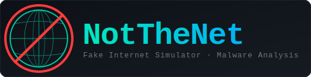

<p align="center">
  
</p>

# NotTheNet Documentation

Welcome to the NotTheNet documentation. NotTheNet is a **fake internet simulator** built for malware analysis.

When you detonate (run) a malware sample in a lab, the malware tries to connect to the internet — it makes DNS lookups, downloads files, sends stolen data, and phones home to command-and-control (C2) servers. NotTheNet pretends to be the entire internet so the malware behaves normally while you watch, but nothing ever leaves your lab.

> **New to malware analysis?** Start with the [Lab Setup](lab-setup.md) guide, which walks you through building an isolated lab from scratch on Proxmox.

---

## Contents

| Document | What it covers |
|----------|----------------|
| [Installation](installation.md) | How to install NotTheNet on Kali (online, offline/USB, or .deb package) |
| [Configuration](configuration.md) | Every setting in `config.json` explained |
| [Usage](usage.md) | How to use the GUI, run in headless mode, and analyse malware step by step |
| [Services](services.md) | Details on every fake service (DNS, HTTP, SMTP, FTP, and 20+ more) |
| [Network & iptables](network.md) | How NotTheNet redirects traffic and what iptables rules it creates |
| [Security Hardening](security-hardening.md) | How to lock down your lab so malware cannot escape |
| [Troubleshooting](troubleshooting.md) | Common problems and how to fix them |
| [Lab Setup: Proxmox + Kali + FlareVM](lab-setup.md) | Build an isolated malware analysis lab from scratch |
| [Safe Detonation](safe-detonation.md) | Step-by-step checklist for safely running a malware sample |
| [Development Setup](development.md) | For contributors: dev environment, tests, project structure |

Man page: [`man/notthenet.1`](../man/notthenet.1)

---

## Quick-Start (TL;DR)

**Option A — .deb package (recommended on Kali):**

```bash
git clone https://github.com/retr0verride/NotTheNet
cd NotTheNet
bash build-deb.sh
sudo dpkg -i notthenet_*.deb
sudo notthenet
```

**Option B — install script:**

```bash
git clone https://github.com/retr0verride/NotTheNet
cd NotTheNet
sudo bash notthenet-install.sh
sudo notthenet
```

> **Note:** Both options require cloning the repo first — there is no standalone download. The `.deb` is built locally from the source.

Then click **▶ Start**.

That's it. From this moment, any program on your analysis machine that tries to "talk to the internet" — whether it's looking up a domain name, loading a web page, sending an email, or connecting to a random port — will get a believable fake response from NotTheNet instead.

---

## Why NotTheNet Instead of INetSim / FakeNet-NG?

INetSim and FakeNet-NG are older tools that do a similar job. The table below compares them — don't worry if you don't understand every row, the important takeaway is that NotTheNet handles many edge cases automatically.

| Issue | INetSim | FakeNet-NG | NotTheNet |
|-------|---------|-----------|-----------|
| DNS race on startup | Common | Occasional | None — DNS binds synchronously |
| Socket leak on restart | Yes (requires `kill -9`) | Occasionally | `SO_REUSEADDR` + clean shutdown |
| Python 3 support | Partial | Yes | Full (3.9+) |
| GUI configuration | No | No | Yes (Tkinter, no extra dep) |
| TLS 1.2+ only | No | No | Yes (configurable cipher list) |
| Privilege drop after bind | No | No | Runs as root; `pkexec` handles privilege for desktop launch |
| Catch-all port redirect | Via config file | Via config file | Auto iptables NAT |
| Log injection prevention | No | No | Yes (CWE-117 sanitised) |
| DNS-over-HTTPS sinkhole | No | No | Yes (GET + POST wire-format) |
| WebSocket sinkhole | No | No | Yes (RFC 6455 handshake + drain) |
| Dynamic HTTP responses | No | No | Yes (70+ MIME types with valid file stubs) |
| Dynamic TLS cert forging | No | No | Yes (per-domain via Root CA + SNI) |
| TCP/IP OS fingerprint spoof | No | No | Yes (TTL, window size, DF, MSS) |
| Structured JSON event log | No | No | Yes (JSONL per-request, pipeline-ready) |
| Single file to read | No | No | Each concern in one module |
| Services covered | DNS, HTTP, HTTPS, SMTP, POP3, IMAP, FTP | DNS, HTTP, HTTPS, SMTP, FTP | DNS · HTTP/S · SMTP/S · POP3/S · IMAP/S · FTP · NTP · IRC/IRCS · TFTP · Telnet · SOCKS5 · MySQL · MSSQL · RDP · SMB · VNC · Redis · LDAP · ICMP · Catch-All |
