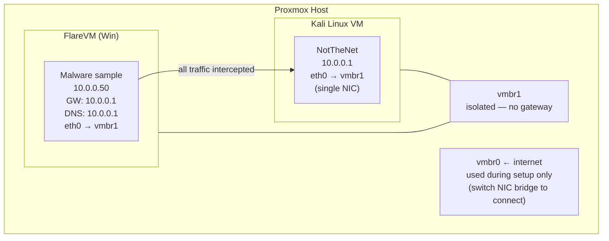

# Lab Walkthrough: NotTheNet + Kali + FlareVM on Proxmox

> **Goal:** Build a fully isolated malware analysis lab where all network traffic from a Windows sandbox (FlareVM) is transparently intercepted by NotTheNet running on Kali — no real internet reachable from the sample.

This walkthrough is step-by-step. You don't need to be an expert — each step explains **what** you're doing and **why**.

---

## Architecture Overview

Here is a diagram of how the lab is laid out. The two VMs (Kali and FlareVM) share an isolated virtual network that has no connection to the real internet.



Each VM has **one NIC**. During setup you switch that NIC to `vmbr0` for internet access, then switch it back to `vmbr1` for analysis. When both VMs are on `vmbr1`, FlareVM has **no route to the real internet** — only to NotTheNet on Kali.

---

## Part 0 — Offline / Air-Gapped Setup

> **Skip this section if your Kali VM has internet access** — the standard path through Parts 1–2 is faster.  
> Use this section if you are building the lab on an **air-gapped** Proxmox host, or if policy prevents the Kali VM from ever reaching the internet — even during setup.

This section covers: downloading the right Kali ISO, getting NotTheNet onto the air-gapped machine via a USB bundle ISO, and mounting it all from Proxmox.

---

### 0.1 Download the Kali offline ISO

The Kali project publishes a fully-offline installer that includes every package on the disc — no internet needed during or after install.

1. On a machine that **does** have internet, go to [https://www.kali.org/get-kali/#kali-installer-images](https://www.kali.org/get-kali/#kali-installer-images).
2. Download the **"Installer" (not "Live")** image — choose `amd64` unless Proxmox is ARM. The offline installer ISO is named like `kali-linux-YYYY.N-installer-amd64.iso` (~4 GB).
3. Verify the SHA256: the hash is listed next to each download on the Kali site.

> **Do not use the "Live" ISO for this.** The Live ISO boots from RAM and does not install a persistent system. The "Installer" ISO runs the Debian-style installer and gives you a real installed Kali.

---

### 0.2 Build the NotTheNet bundle on Windows

On your Windows machine (the one with internet):

```powershell
cd U:\NotTheNet
.\make-bundle.ps1 -SkipChecks
```

This produces `dist\NotTheNet-<version>.zip` containing all Python dependencies (pre-downloaded wheels), the scripts, and the offline installer. No internet needed on the target machine.

> `make-bundle.ps1` requires Python 3.10+ and pip in PATH. It pip-downloads all wheels declared in `requirements.txt` into the bundle before zipping.

---

### 0.3 Create a bundle ISO

Proxmox cannot directly mount a `.zip` as a virtual CD drive, so wrap the bundle in an ISO:

**On Windows (using `oscdimg` from the Windows ADK, or `mkisofs` via WSL):**

```powershell
# Option A — Windows ADK (oscdimg):
# Download ADK from https://learn.microsoft.com/en-us/windows-hardware/get-started/adk-install
# Install, choose only "Deployment Tools" component

$src = "dist"
$iso = "dist\notthenet-bundle.iso"
& "C:\Program Files (x86)\Windows Kits\10\Assessment and Deployment Kit\Deployment Tools\amd64\Oscdimg\oscdimg.exe" `
    -n -m -o "$src" "$iso"
```

```bash
# Option B — WSL / Linux:
mkisofs -o dist/notthenet-bundle.iso dist/
```

The result is a `notthenet-bundle.iso` you can upload to Proxmox alongside the Kali ISO.

---

### 0.4 Upload ISOs to Proxmox

In the Proxmox web UI:

1. **Datacenter → _your node_ → local → ISO Images → Upload**
2. Upload `kali-linux-*-installer-amd64.iso`
3. Upload `notthenet-bundle.iso`

Both should appear in the ISO list once uploaded.

---

### 0.5 Create the Kali VM with both ISOs

Follow [Part 1 (Proxmox Network Setup)](#part-1--proxmox-network-setup) and [Part 2.1 (Create the VM)](#21-create-the-vm) normally, **but**:

- Set the primary CD/DVD drive to the Kali installer ISO.
- Add a **second CD/DVD drive** for the bundle:
  - Proxmox → **kali-notthenet → Hardware → Add → CD/DVD Drive**
  - Bus: `IDE`, Device: `1`
  - Select `notthenet-bundle.iso`

> Having two CD drives lets Kali install from one ISO and read the bundle from the other without needing network access for either.

**Network tab:** `net0` → `vmbr1` **only** — the VM never needs internet. Do **not** attach `vmbr0`.

---

### 0.6 Install Kali from ISO

Boot the VM. The Kali installer starts automatically.

Key installer choices for an air-gapped install:

| Installer screen | Setting |
|-----------------|---------|
| Software selection | Accept defaults (uses the offline packages on the disc) |
| Network mirror | **"No"** — do not configure a network mirror |
| Proxy | Leave blank |

Complete the install normally. When done, the VM will reboot into Kali.

---

### 0.7 Install NotTheNet from the bundle ISO

After Kali boots, the second CD drive (bundle ISO) is available. Mount and install:

```bash
# Find the CD drive device (usually /dev/sr0 or /dev/sr1)
lsblk -o NAME,TYPE,FSTYPE,LABEL | grep -i iso

# Mount the bundle ISO (example using /dev/sr1 — adjust if needed)
sudo mkdir -p /mnt/bundle
sudo mount /dev/sr1 /mnt/bundle

# The bundle zip is at the root of the ISO
ls /mnt/bundle/
# → NotTheNet-<version>.zip  (and possibly other files)

# Extract and install
cp /mnt/bundle/NotTheNet-*.zip /tmp/
cd /tmp
unzip NotTheNet-*.zip
cd NotTheNet
sudo bash notthenet-bundle.sh

sudo umount /mnt/bundle
```

The bundle installer creates the virtualenv, installs all bundled wheels, generates TLS certificates, installs the desktop launcher, and sets up polkit rules — identical to the online install, but entirely offline.

After this step, continue from [Part 2.3 (Configure the lab interface)](#23-configure-the-lab-interface) — you can skip the NIC-switch steps since this VM is already on `vmbr1`.

---

### 0.8 Updating an existing install from a new bundle ISO

When a new version of NotTheNet is released, rebuild the bundle on Windows (`.\make-bundle.ps1 -SkipChecks`), create a new ISO (§0.3), upload it to Proxmox (§0.4), and attach it to the running Kali VM:

**Attach the new bundle ISO to an already-running VM:**

Proxmox → **kali-notthenet → Hardware → CD/DVD Drive (ide1) → Edit** → select the new ISO → OK.

No reboot needed — Proxmox hot-swaps the virtual disc.

**On Kali, mount and update:**

```bash
# Re-mount (unmount first if the old ISO is still mounted)
sudo umount /mnt/bundle 2>/dev/null || true
sudo mount /dev/sr1 /mnt/bundle

# Extract to /tmp (always extract fresh — do not overwrite a running install in-place)
cp /mnt/bundle/NotTheNet-*.zip /tmp/
cd /tmp
rm -rf NotTheNet_update && mkdir NotTheNet_update
unzip -o NotTheNet-*.zip -d NotTheNet_update
cd NotTheNet_update/NotTheNet

# Run in update mode — preserves config.json, certs/, and logs/
sudo bash notthenet-bundle.sh --update

sudo umount /mnt/bundle
```

The `--update` flag skips the interactive prompt and always copies new files into your existing install directory without touching your settings, certificates, or captured logs. See [Installation → Method 2 (Offline / USB bundle)](installation.md#method-2--offline--usb-bundle) for full details on what is and is not overwritten.

---

## Part 1 — Proxmox Network Setup

### 1.1 Create the isolated lab bridge

A "bridge" in Proxmox is like a virtual network switch. You're going to create one (`vmbr1`) that connects your VMs to each other but has **no connection to the real internet**.

In Proxmox web UI: **Node → System → Network → Create → Linux Bridge**

| Field | Value |
|-------|-------|
| Name | `vmbr1` |
| **Bridge ports** | ***(leave blank)*** |
| IP address | *(leave blank)* |
| Subnet mask | *(leave blank)* |
| Gateway | *(leave blank)* |
| Autostart | ✔ |
| Comment | `NotTheNet isolated lab` |

Click **Create**, then **Apply Configuration**.

> **No second physical NIC required.** Leaving **Bridge ports** empty creates a purely internal virtual switch that exists only between VMs. No real network traffic passes through it. Your Proxmox host only needs one physical network card.

---

## Part 2 — Kali VM Setup

### 2.1 Create the VM

Proxmox → **Create VM**:

| Setting | Value |
|---------|-------|
| Name | `kali-notthenet` |
| ISO | Kali Linux installer ISO (upload to local storage first) |
| OS type | Linux, kernel 6.x |
| Disk | 40 GB+ (for logs and captures) |
| CPU | 2+ cores |
| RAM | 4 GB+ |

**Network tab:** `net0` → `vmbr0` — for the initial Kali install and downloading NotTheNet (internet access needed).

> After NotTheNet is installed you will switch this NIC to `vmbr1` in Proxmox (see section 2.3). No second NIC is required.

### 2.2 Install Kali

Boot the ISO and run a standard Kali install. When complete, remove the ISO from the VM's CD drive: **Hardware → CD/DVD Drive → Do not use any media**.

### 2.3 Configure the lab interface

At this point Kali's NIC is on `vmbr0` and has internet access — use it to install NotTheNet first (section 2.5), then come back here to switch to the isolated bridge.

**Switch Kali's NIC to `vmbr1`:**

In Proxmox: **kali-notthenet → Hardware → Network Device (net0) → Edit → Bridge: `vmbr1`** → OK.

> This cuts Kali's internet access. That is correct and intentional — during analysis Kali only needs the isolated lab network. To get internet back temporarily (e.g. to run `apt update`), switch the bridge back to `vmbr0`, update, then switch back to `vmbr1`.

**Assign the static IP — GUI (easiest):**

Right-click the **network icon** in the Kali taskbar (bottom-right) → **Edit Connections…** (or **Network Connections**):

1. Select the wired connection → click the **gear/edit** icon
2. Go to the **IPv4 Settings** tab
3. Set **Method** to `Manual`
4. Click **Add** and enter:
   - Address: `10.0.0.1`
   - Netmask: `255.255.255.0`
   - Gateway: *(leave blank)*
5. Click **Save**
6. Click the network icon again → disconnect and reconnect the wired connection to apply

**Assign the static IP — terminal (alternative):**

```bash
# Find your NIC name first (eth0, ens18, etc.)
ip link show

# Replace eth0 with your actual NIC name if different
export LAB_IF=eth0

sudo nmcli con add \
  type ethernet \
  ifname "$LAB_IF" \
  con-name lab \
  ip4 10.0.0.1/24

sudo nmcli con up lab
```

> If you see `Warning: There is another connection with the name 'lab'`, a previous attempt left a stale profile:
> ```bash
> sudo nmcli con delete lab
> sudo nmcli con add type ethernet ifname "$LAB_IF" con-name lab ip4 10.0.0.1/24
> sudo nmcli con up lab
> ```

**Verify:**
```bash
ip addr show
# Should show inet 10.0.0.1/24 on your NIC
```

### 2.4 IP forwarding

IP forwarding allows packets to flow from FlareVM through Kali so NotTheNet can intercept them.

**NotTheNet enables this automatically** when gateway mode is active — you don't need to set anything manually. The original setting is restored when NotTheNet stops.

> If you check `/proc/sys/net/ipv4/ip_forward` while NotTheNet is running in gateway mode, you will see `1`.

### 2.5 Install NotTheNet

**Internet-connected Kali:**

```bash
cd ~
git clone https://github.com/retr0verride/NotTheNet
cd NotTheNet

sudo bash notthenet-install.sh
```

**Air-gapped Kali (USB bundle from Windows):**

```bash
# On Windows -- build bundle, push to GitHub, create release:
.\make-bundle.ps1

# On Kali -- unzip and install from USB:
unzip /media/usb/NotTheNet-*.zip
cd NotTheNet
sudo bash notthenet-bundle.sh
```

See [Offline / USB Install](installation.md#offline--usb-install) for full details.

The installer creates a virtualenv, installs Python dependencies, generates TLS certificates, installs the desktop launcher, and sets up polkit rules so you can launch with GUI elevation.

### 2.6 Configure NotTheNet

Launch the GUI:
```bash
sudo notthenet
```

Click **⚙ General** in the sidebar and set:

| Field | Value | Notes |
|-------|-------|-------|
| Bind IP | `0.0.0.0` | Listen on all interfaces |
| Redirect IP | `10.0.0.1` | Kali's lab IP — all DNS resolves here |
| Interface | `eth0` | Your NIC name — use the name from `ip link show` (may be `ens18` etc.) |
| iptables mode | `gateway` | PREROUTING — intercepts traffic arriving from FlareVM |
| Auto iptables | ✔ | Rules applied/removed automatically on start/stop |
| Log level | `INFO` | Increase to `DEBUG` for detailed per-packet logging |
| Log to file | ✔ | Written to `logs/notthenet.log` |

Configure individual services as needed (all can be left at defaults for basic analysis):

- **DNS** — leave `resolve_to` at `127.0.0.1`; it will be rewritten to `10.0.0.1` by iptables redirect
- **HTTP/HTTPS** — default `200 OK` response with a generic body is fine; `dynamic_responses` is enabled by default and will serve correct MIME types + valid file stubs for 70+ extensions
- **HTTPS** — `dynamic_certs` is enabled by default; a Root CA is auto-generated at `certs/ca.crt` — install it in FlareVM's trust store for seamless HTTPS interception (see section 4.9)
- **Catch-All** — ensure it is enabled; this catches any ports not handled by a specific service

**Optional advanced features:**

| Feature | Setting | Recommended for |
|---------|---------|----------------|
| **TCP fingerprint spoof** | `tcp_fingerprint: true`, `tcp_fingerprint_os: "windows"` | Windows malware that checks OS fingerprints |
| **JSON event logging** | `json_logging: true` | Automated pipelines (CAPEv2, Splunk, ELK) |
| **DoH sinkhole** | `doh_sinkhole: true` (already default) | Malware that bypasses DNS via DoH |
| **WebSocket sinkhole** | `websocket_sinkhole: true` (already default) | WebSocket-based C2 channels |

Click **💾 Save**, then **▶ Start**.

The status indicator turns green and the log shows each service binding. Confirm iptables rules were applied:

```bash
sudo iptables -t nat -L PREROUTING -n -v | grep NOTTHENET
```

---

## Part 3 — FlareVM Setup

FlareVM is Mandiant's Windows-based malware analysis distribution. It installs as a Chocolatey/PowerShell overlay on top of a plain Windows VM.

### 3.1 Create the Windows VM in Proxmox

Proxmox → **Create VM**:

| Setting | Value |
|---------|-------|
| Name | `flarevm` |
| ISO | Windows 10/11 installer ISO |
| OS type | Microsoft Windows |
| Disk | 100 GB+ (FlareVM tools are large) |
| CPU | 4+ cores |
| RAM | 8 GB+ (16 GB recommended) |
| **Network** | `vmbr1` **only** — no `vmbr0` |

> Attaching only `vmbr1` means FlareVM has **no path to the internet**, only to Kali. This is intentional and critical for containment.

### 3.2 Install Windows

Boot the ISO, install Windows. When the network setup screen appears and asks for a network: choose **"I don't have internet"** → **"Continue with limited setup"**. Create a local account (no Microsoft account required or possible with no internet).

After install, remove the ISO: **Hardware → CD/DVD → Do not use any media**.

### 3.3 Install VirtIO drivers (if needed)

If the VM shows poor disk/network performance, download the VirtIO ISO from the Proxmox mirrors, attach it, and run the VirtIO installer from it. For analysis VMs this is optional.

### 3.4 Set a static IP on FlareVM

Open **Control Panel → Network and Sharing Center → Change adapter settings**.

Right-click the NIC → **Properties → Internet Protocol Version 4 (TCP/IPv4) → Properties**:

```
○ Use the following IP address:

  IP address:    10.0.0.50
  Subnet mask:   255.255.255.0
  Default gateway: 10.0.0.1

○ Use the following DNS server addresses:

  Preferred DNS server: 10.0.0.1
```

Click **OK**. Verify connectivity to Kali:
```cmd
ping 10.0.0.1
```

### 3.5 Install FlareVM

> **FlareVM needs real internet to install.** Before running the installer, temporarily switch FlareVM's NIC to `vmbr0` so it can download its components (around 10–15 GB).

**Switch FlareVM to internet temporarily:**

Proxmox → **flarevm → Hardware → Network Device (net0) → Edit → Bridge: `vmbr0`** → OK.

Inside FlareVM, set this NIC to DHCP (**Network Settings → adapter → Properties → IPv4 → Obtain automatically**) and verify you have internet (`curl https://www.google.com` or open a browser).

**FlareVM install steps:**

Open PowerShell as Administrator on FlareVM:

```powershell
Set-ExecutionPolicy Unrestricted -Force

$installer = "$env:TEMP\flarevm.ps1"
(New-Object Net.WebClient).DownloadFile(
    'https://raw.githubusercontent.com/mandiant/flare-vm/main/install.ps1',
    $installer
)
Unblock-File $installer
& $installer
```

The installer opens a GUI letting you choose which tool packages to install. Select what you need for your analysis workflow (the defaults are a good starting point). Installation takes 1–2 hours depending on what you select.

**After FlareVM install completes — switch back to the isolated bridge:**

Proxmox → **flarevm → Hardware → Network Device (net0) → Edit → Bridge: `vmbr1`** → OK.

Then inside FlareVM, re-apply the static IP from section 3.4 (it will have been overwritten by DHCP). From this point on FlareVM has no real internet.

### 3.6 Enable WMI and disable Windows Firewall

NotTheNet's **Preflight** checks (the pre-flight checker that runs before analysis) can remotely verify FlareVM's configuration. This uses WMI (Windows Management Instrumentation), which is blocked by Windows Firewall by default.

Open an **Administrator PowerShell** on FlareVM and run:

```powershell
# Disable Windows Firewall (safe — the isolated bridge provides containment)
Set-NetFirewallProfile -Profile Domain,Public,Private -Enabled False

# Verify WMI service is running
Get-Service Winmgmt | Select-Object Status
```

> **Why disable the firewall entirely?** FlareVM has no internet — it only connects to Kali. The firewall provides no security benefit here but it blocks remote management features. Disabling it avoids chasing individual firewall rules.

If you prefer to keep the firewall on, enable only WMI:
```powershell
netsh advfirewall firewall set rule group="Windows Management Instrumentation (WMI)" new enable=yes
```

### 3.7 Take a clean baseline snapshot

Before detonating anything, snapshot FlareVM in a known-good state:

Proxmox → **flarevm → Snapshots → Take Snapshot**

| Field | Value |
|-------|-------|
| Name | `clean-baseline` |
| Description | `Pre-detonation — FlareVM installed, no samples` |
| Include RAM | Optional (faster rollback with RAM, larger snapshot without) |

---

## Part 4 — Full Lab Verification

Before detonating any samples, run through this checklist to confirm every layer of the lab is working. This takes about 5 minutes and saves a lot of confusion later.

### 4.1 Ping (basic connectivity)

From FlareVM CMD:
```cmd
ping 10.0.0.1
```
Expected: replies from Kali.

### 4.2 DNS

From FlareVM (cmd or PowerShell — `nslookup` works on every Windows version):
```cmd
nslookup evil-c2-domain.com
nslookup updates.microsoft.com
nslookup anything-at-all.xyz
```
Every query should return `10.0.0.1`. Check the NotTheNet DNS log entries appear in the live log.

### 4.3 HTTP

From FlareVM (cmd or PowerShell — `curl.exe` is built into Windows 10+):
```cmd
curl.exe -i http://google.com
```
Expected: response starts with `HTTP/1.1 200 OK`. The `Server:` header will be whatever you configured (default: `Apache/2.4.51 (Debian)`).

### 4.4 HTTPS

```cmd
curl.exe -ik https://google.com
```
Expected: response starts with `HTTP/1.1 200 OK`. The TLS handshake will succeed with NotTheNet's auto-generated certificate.

### 4.5 SMTP

```cmd
curl.exe -s -m 5 telnet://10.0.0.1:25
```
Expected: the SMTP banner, e.g. `220 mail.example.com ESMTP Postfix` (matches whatever you set in the Banner field).

### 4.6 FTP

```cmd
curl.exe -s -m 5 telnet://10.0.0.1:21
```
Expected: the FTP banner, e.g. `220 FTP Server Ready` (matches whatever you set in the Banner field).

### 4.7 Non-standard port (Catch-All)

```cmd
curl.exe -s -m 5 telnet://10.0.0.1:4444
curl.exe -s -m 5 telnet://10.0.0.1:8443
```
Expected: `200 OK` — caught by the TCP Catch-All service. These appear in the NotTheNet log as `catch_all` entries.

### 4.8 Confirm isolation (no real internet)

This is the most important check. Confirm that **nothing can reach the real internet**.

```cmd
curl.exe -s -m 5 telnet://8.8.8.8:53
```
Expected: no output / command returns after 5 seconds with no response.

> If output appears, FlareVM still has a path to the internet. Go back to Proxmox and confirm `vmbr0` is not attached to FlareVM.

### 4.9 Dynamic TLS certs (install Root CA)

When `https.dynamic_certs` is enabled (the default), NotTheNet creates a unique certificate for every website malware connects to. For this to work without certificate errors, you need to install NotTheNet's Root CA certificate in Windows.

**Think of it this way:** Windows asks "who signed this certificate?" When malware connects to `https://evil-c2.com`, NotTheNet creates a certificate on the spot. Windows will only trust it if you've told Windows to trust NotTheNet's Root CA as an authority.

Steps:

1. Copy `certs/ca.crt` from Kali to FlareVM (e.g. via the Python HTTP server in Part 6)
2. On FlareVM: double-click `ca.crt` → **Install Certificate** → **Local Machine** → **Place all certificates in the following store** → **Trusted Root Certification Authorities** → Finish

Verify:
```cmd
curl.exe -s https://evil-c2.com/
```
Expected: `200 OK` response **without** a certificate error.

### 4.10 Dynamic responses

```cmd
curl.exe -o test.exe http://10.0.0.1/update/payload.exe
```
Expected: a small file is downloaded. Inspecting with `file test.exe` (or a hex editor) should show a valid PE header (MZ magic bytes).

### 4.11 JSON event logging

If `json_logging` is enabled, check that events are being recorded:

On Kali:
```bash
tail -f logs/events_$(date +%Y-%m-%d)_s*.jsonl
```
Expected: JSON objects appear in real time as FlareVM generates traffic. Each object has `timestamp`, `event`, `src_ip`, and service-specific fields.

In the GUI: click **JSON Events** in the **ANALYSIS** sidebar group to view events in the live treeview.

---

## Part 5 — Wireshark Setup (Kali)

Kali is the gateway for all FlareVM traffic — every packet passes through the lab NIC (`ens19` in the example, your actual name from section 2.3) before NotTheNet processes it. Capturing on that interface gives a complete packet-level record of everything the sample sends, independent of what NotTheNet logs.

> Substitute `ens19` below with your real lab interface name identified in section 2.3.

### 5.1 Install Wireshark / tshark

Wireshark and tshark are included in Kali by default. If missing:

```bash
sudo apt-get install -y wireshark tshark
```

To allow non-root GUI captures:

```bash
sudo dpkg-reconfigure wireshark-common

sudo usermod -aG wireshark $USER

newgrp wireshark
```

### 5.2 Live GUI capture

```bash
sudo wireshark &
```

Select your lab interface (`ens19` / whatever name you identified in section 2.3 — it is the one on `vmbr1`) and click the blue shark fin to start. Useful display filters:

| Display filter | What it shows |
|----------------|---------------|
| `ip.src == 10.0.0.50` | All traffic originating from FlareVM |
| `dns` | Every DNS query and response |
| `http` | Plain HTTP streams |
| `tcp.port == 443` | HTTPS / TLS handshakes |
| `smtp \|\| pop \|\| imap` | Mail protocol traffic |
| `ftp \|\| ftp-data` | FTP control and data channels |
| `ip.src == 10.0.0.50 && !dns` | All non-DNS traffic from FlareVM |

### 5.3 Headless capture with tshark

`tshark` is better for long sessions — it writes directly to `.pcapng` without opening a GUI.

```bash
# Replace ens19 with your actual lab interface name (identified in section 2.3)
sudo tshark -i ens19 \
  -f "host 10.0.0.50" \
  -b filesize:102400 -b files:5 \
  -w ~/captures/flarevm-$(date +%Y%m%d-%H%M%S).pcapng
```

Stop with **Ctrl+C**. To target specific protocols only (smaller files):

```bash
sudo tshark -i ens19 \
  -f "host 10.0.0.50 and (port 53 or port 80 or port 443 or port 25 or port 21)" \
  -w ~/captures/flarevm-targeted.pcapng
```

### 5.4 Post-capture analysis with tshark

Extract useful fields from a saved capture without opening the GUI:

```bash
tshark -r ~/captures/flarevm.pcapng \
  -Y "http.request" \
  -T fields -e http.request.method -e http.host -e http.request.uri

tshark -r ~/captures/flarevm.pcapng \
  -Y "dns.flags.response == 0" \
  -T fields -e frame.time -e dns.qry.name

tshark -r ~/captures/flarevm.pcapng -q -z follow,tcp,ascii,0
```

### 5.5 Export the capture to a Windows machine

Serve the capture from Kali so it can be downloaded on any analysis workstation:

```bash
cd ~/captures
python3 -m http.server 8080
```

Browse to `http://10.0.0.1:8080/` from a Windows host, download the `.pcapng`, and open it in Wireshark or upload it to a service like [PacketTotal](https://packettotal.com). Stop the server when done (`Ctrl+C`).

---

## Part 6 — Detonation Workflow

### 6.1 Transfer the sample to FlareVM

On **Kali**, serve the sample over HTTP:
```bash
cd /path/to/samples
python3 -m http.server 8080
```

On **FlareVM**, download it:
```cmd
curl.exe -o C:\Samples\sample.exe http://10.0.0.1:8080/sample.exe
```

Stop the Python server on Kali when done (`Ctrl+C`).

> Alternatively, use a Proxmox shared directory or attach a separate ISO with the sample — whichever fits your workflow.

### 6.2 Snapshot before detonation

Take a fresh snapshot immediately before running the sample so you can cleanly revert:

Proxmox → **flarevm → Snapshots → Take Snapshot** → name it `pre-detonation`

### 6.3 Set up monitoring tools on FlareVM

Before executing the sample, start your tooling:

| Tool | Purpose |
|------|---------|
| **Wireshark** | Capture raw traffic on the FlareVM NIC (see also Part 5 for gateway capture on Kali) |
| **Process Monitor (ProcMon)** | File system, registry, process activity |
| **Process Hacker** | Live process tree and memory inspection |
| **x64dbg / x32dbg** | Dynamic debugging if needed |

Start a Wireshark capture on the lab NIC (the `10.0.0.x` interface) before execution. For a full gateway-level capture of all traffic leaving FlareVM, see **Part 5**.

### 6.4 Detonate

Execute the sample on FlareVM. Watch:

- **NotTheNet live log** (on Kali) — every DNS query, HTTP request, SMTP connection, or catch-all hit appears in real time, colour-coded by service
- **Wireshark** — raw packets for protocol-level detail
- **ProcMon** — filesystem and registry changes

### 6.5 Collect artifacts

**On Kali:**

```bash
cat logs/notthenet.log

ls logs/emails/

ls logs/ftp_uploads/
```

**On FlareVM:**
- Save the Wireshark `.pcapng`
- Save ProcMon `.pml`
- Dump any processes of interest with Process Hacker

### 6.6 Revert FlareVM

Proxmox → **flarevm → Snapshots → Rollback** to `clean-baseline` (or `pre-detonation`).

The VM is restored to a clean state, ready for the next sample.

---

## Part 7 — Custom DNS Records

If a sample uses a hardcoded C2 hostname, add a custom record in NotTheNet so it resolves to a specific IP (useful for routing to a separate listener or a different Kali port):

In the NotTheNet GUI → **DNS panel → Custom DNS Records**:
```
c2.evil-domain.com = 10.0.0.1
updates.malware.net = 10.0.0.1
```

One record per line, `hostname = ip` format. These take precedence over the default catch-all resolution.

---

## Troubleshooting

### FlareVM traffic not being intercepted

1. Confirm iptables mode is `gateway` (not `loopback`) in NotTheNet General settings
2. Check iptables rules exist: `sudo iptables -t nat -L PREROUTING -n -v | grep NOTTHENET`
3. Confirm FlareVM's NIC is on `vmbr1` and Kali's NIC is also on `vmbr1` (Proxmox Hardware settings for each VM)
4. Confirm FlareVM's default gateway is `10.0.0.1`: `ipconfig` on FlareVM

### DNS queries not resolving to 10.0.0.1

- Confirm FlareVM DNS is set to `10.0.0.1` (not auto/DHCP)
- Confirm the DNS service is running in NotTheNet (green dot next to DNS in sidebar)
- Test from Kali itself: `dig @127.0.0.1 test.com +short` — `@127.0.0.1` queries NotTheNet's DNS server directly; `+short` prints only the answer IP. Should return `127.0.0.1`

### HTTPS certificate errors breaking the sample

Some malware validates TLS certificates and will abandon connections if the cert is wrong. This is expected — the sample will still appear in the log hitting port 443. For deeper HTTPS interception, configure the sample's trust store to include NotTheNet's CA (`certs/ca.crt`) or use a tool like mitmproxy in front of NotTheNet.

### NotTheNet won't start (port already in use)

```bash
sudo ss -tulpn | grep :53

sudo systemctl disable --now systemd-resolved
```

Then retry **▶ Start** in NotTheNet.

### FlareVM still has real internet after removing vmbr0

Check Proxmox → flarevm → Hardware — confirm only `vmbr1` is attached. Also confirm no VPN client or proxy is running inside FlareVM.

### Removing leftover iptables rules

If NotTheNet was killed unexpectedly (power loss, `kill -9`, host crash) it may not have had a chance to clean up its NAT rules. To remove them manually:

```bash
# List all NOTTHENET rules and their line numbers
sudo iptables -t nat -L PREROUTING --line-numbers -n -v
sudo iptables -t nat -L OUTPUT --line-numbers -n -v

# Delete each NOTTHENET rule by line number (repeat for each)
# Example: delete line 1 from PREROUTING
sudo iptables -t nat -D PREROUTING 1

# Or flush *all* NAT rules if the machine is used solely for this lab
sudo iptables -t nat -F

# Confirm the table is clean
sudo iptables -t nat -L -n -v
```

To also disable IP forwarding at the same time:

```bash
sudo sysctl -w net.ipv4.ip_forward=0
sudo rm -f /etc/sysctl.d/99-notthenet.conf
```

After restarting NotTheNet normally (**▶ Start**), it will re-apply only its own rules cleanly.

---

## Part 8 — Anti-Detection Hardening

Modern malware frequently checks for sandbox and VM indicators before executing its payload. This section covers hardening the lab so the environment is indistinguishable from a real physical workstation.

### 8.1 Proxmox VM hardware config (FlareVM)

These changes modify the FlareVM's virtual hardware so that malware cannot tell it is running inside a VM. You will edit the VM's config file directly on the Proxmox host — this cannot be done from the Proxmox web UI.

**Step-by-step:**

1. **Shut down FlareVM** — the config file cannot be edited while the VM is running. In Proxmox UI: right-click the VM → **Shutdown**.

2. **SSH into the Proxmox host:**
   ```bash
   ssh root@<proxmox-ip>
   ```

3. **Find FlareVM's VMID** (the number in the ID column):
   ```bash
   qm list
   ```

4. **Back up the existing config** (so you can revert if something breaks):
   ```bash
   cp /etc/pve/qemu-server/<VMID>.conf /etc/pve/qemu-server/<VMID>.conf.bak
   ```

5. **Open the config file:**
   ```bash
   nano /etc/pve/qemu-server/<VMID>.conf
   ```

6. **Apply the changes below.** Some lines already exist and need to be **replaced** (like `cpu:`, `machine:`, `memory:`, `cores:`, `bios:`). Others are **new** and must be **added** (like `args:`, `smbios1:`, `tpmstate0:`). The comments below indicate which is which.

7. **Save and exit** (`Ctrl+O`, `Enter`, `Ctrl+X` in nano), then start the VM from the Proxmox UI.

```ini
# REPLACE existing cpu: line
cpu: host,hidden=1,flags=+pcid

# ADD — anti-detection QEMU flags (this line is new; paste it exactly as shown)
args: -cpu host,kvm=off,hv-vendor-id=GenuineIntel,-hypervisor,+pcid,+invtsc,tsc-frequency=3600000000 -overcommit cpu-pm=on

# ADD — realistic SMBIOS so WMI reports a Dell desktop, not "QEMU"
smbios1: manufacturer=Dell Inc.,product=OptiPlex 7090,version=1,serial=7GH2JK3,uuid=a1b2c3d4-e5f6-7890-abcd-ef1234567890,family=Desktop

# REPLACE existing machine: line (i440fx is an immediate sandbox flag)
machine: q35

# REPLACE existing memory: line — low RAM is a sandbox indicator
memory: 16384

# REPLACE existing cores: line
cores: 2

# REPLACE existing sata0/scsi0 line (adjust storage name to match yours)
sata0: local-lvm:vm-200-disk-1,size=256G

# ADD — TPM 2.0 (Windows 11 requires it; presence indicates a real PC)
tpmstate0: local-lvm:vm-200-disk-2,size=4M,version=v2.0

# REPLACE existing bios: line (must be UEFI, not SeaBIOS)
bios: ovmf
```

> **Tip:** If you already created the VM with the default `i440fx` machine type and `seabios`, you will need to reinstall Windows after switching to `q35` + `ovmf`. It is easier to apply these settings **before** installing the OS. If you followed this guide from the start, go back to section 3.1 and recreate the VM with these settings first.

**What each flag does:**

| Flag | Defeats |
|------|---------|
| `kvm=off` | Hides KVM from CPUID |
| `hv-vendor-id=GenuineIntel` | Replaces `KVMKVMKVM` hypervisor vendor string |
| `-hypervisor` | Clears the hypervisor CPUID bit entirely |
| `+invtsc` | Invariant TSC — prevents timing-based VM detection |
| `tsc-frequency=3600000000` | Fixed TSC frequency matches a real 3.6 GHz CPU |
| `-overcommit cpu-pm=on` | Enables CPU power management states (C-states) |
| `cpu: host,hidden=1` | Passes real CPU model; `hidden=1` = KVM stealth mode |
| `smbios1` | Controls `Win32_ComputerSystem.Manufacturer` / `.Model` (WMI) |
| `machine: q35` | Modern Intel chipset — `i440fx` is an immediate sandbox flag |

> **Verify after boot** (PowerShell on FlareVM):
> ```powershell
> (Get-WmiObject Win32_Processor).Name          # Should show your real CPU
> (Get-WmiObject Win32_ComputerSystem).Manufacturer  # Should show "Dell Inc."
> ```

### 8.2 Proxmox firewall — disable for lab VMs

The Proxmox VM-level firewall evaluates packets **before** they reach the guest OS. It sees the original destination IP (e.g. `8.8.8.8`) — not the DNAT'd address — and drops packets that don't match an ACCEPT rule. This breaks NotTheNet's traffic interception even when iptables rules are correctly configured inside Kali.

**Fix: disable the firewall on both lab VMs.**

The isolated bridge (`vmbr1` with no physical uplink) already provides full containment — no packet can physically leave the Proxmox host. The firewall adds no value.

1. Proxmox UI → **Kali VM → Firewall → Options → Firewall: No**
2. Proxmox UI → **FlareVM → Firewall → Options → Firewall: No**

> Disabling per-VM does not affect other VMs or the datacenter-level firewall.

### 8.3 Display resolution

A VM defaulting to 800×600 or 1280×800 is a well-known sandbox indicator. Set 1920×1080:

1. Boot FlareVM and press **F2** during POST to enter the OVMF UEFI setup
2. Navigate to **Device Manager → OVMF Platform Configuration → Change Preferred Resolution**
3. Select **1920x1080**
4. Press **F10** to save, then **Y** to confirm, then **Escape** back to the main menu and **Reset**

> This is a persistent UEFI NVRAM setting — it survives reboots and snapshot rollbacks.

### 8.4 Additional hardening checklist

| Check | Target value | How to set |
|-------|-------------|------------|
| **RAM** | 8 GB+ (16 GB recommended) | Proxmox VM Hardware |
| **CPU cores** | 2+ | Proxmox VM Hardware |
| **Disk size** | 100 GB+ | Proxmox VM Hardware |
| **Screen resolution** | 1920×1080 | Section 8.4 above |
| **No guest agent** | Do not install `qemu-guest-agent` on FlareVM | (omit from install) |
| **No VM tools** | Do not install VirtIO or VMware drivers on FlareVM | (omit from install) |
| **Display adapter** | Use `vga: std` — not VirtIO/QXL (detectable PCI IDs) | `200.conf` |
| **User artifacts** | Desktop files, browser bookmarks, recent docs | Stage manually |
| **Uptime** | Boot and idle 10+ min before detonating | Wait before running samples |

### 8.5 Snapshot strategy

After completing all hardening steps (sections 8.1–8.4) and verifying the lab is working:

1. Verify resolution and NIC MAC
2. Take a **Stealth** snapshot — clean OS with all hardening applied, no analysis tools
3. Install FlareVM tools on top
4. Take a **Pre-detonate** snapshot — tools installed, ready for samples
5. Before each sample: branch a **New-Samples** snapshot from **Pre-detonate**
6. After analysis: rollback to **Pre-detonate** (keeps tools installed, reverts sample artifacts)

